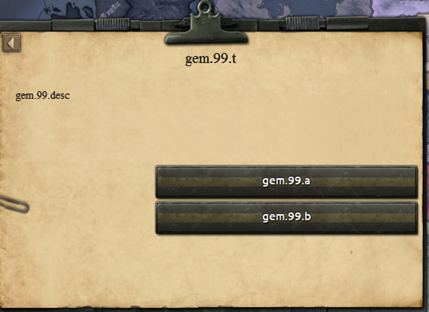
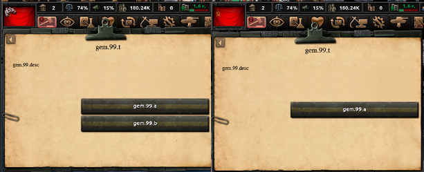

# Игровые события. Работа с игровыми событиями 

1. Назначение Ивента. Пространство имен. 
2. Национальный ивент. Синтаксис ивента.
3. Работа с MTTH. Понятие сопровождаемого эффекта.
4. Работа с опциями ивента. Триггер опции.
5. Новостной ивент. Основные ошибки
6. Ивент командующего. Ивент оперативника
7. Советы бывалого и подводные камни

## Начнем с простого. Что такое ивент?

Игровые события, или ивенты - это уведомления игрока о произошедшем событии (неожиданно, да?). Это может быть сообщение о восстании, новость о начале войны, донесение о ранении или рапорт о захвате оперативника. ПРи этом игрок часто может выбирать ответ, и он повлияет на результат события. Вкупе с фокусами, национальными духами и решениями, ивенты являют собой базовый скрипт. 

Ивенты расположены в папке events в корневой папке мода

## Для начала - о пространстве имен

Взглянув в ванильный код, вы заметите сходство между всеми файлами ивентов: в начале каждого идет строка add_namespace. Без преувеличения скажу: это - САМАЯ ВАЖНАЯ СТРОКА В ФАЙЛЕ. Потому что без нее работать не будет НИ-ЧЕ-ГО

Что дает эта строка? Если говорить коротко - она позволяет игре создать массив айди и перечисление. То есть, ОТ ПРОСТРАНСТВА ИМЕН ЗАВИСЯТ АЙДИ ИВЕНТОВ

    add_namespace = namespace

Теперь <b>ВСЕ АЙДИ ИВЕНТОВ</b> должны начинаться с этого пространства имен

Вот так ваш ивент будет работать:

    country_event = {
        id = namespace.1     
    }

А вот так - НЕТ!

    country_event = {
        id = event.1     
    }

Ведь у нас не существует пространства имен event, только namespace
Кстати говоря, ПРОСТРАНСТВО ИМЕН ПРИВЯЗАНО К ФАЙЛУ.  Вы не можете создать пространство имен в одном файле и ссылаться на него в другом. 

## Итак, переходим к первым ивентам. Каков их синтаксис?

Самый распространенный тип ивентов - Национальные (country) ивенты. Синтаксис ивентов в целом одинаковый... за исключением нескольких моментов, но обо всем по порядку

<h2>Каков основной синтаксис создания ивентов?</h2> 

{ } - Блок. Каждый блок открывается и закрывается, и несет в себе какую-то часть скрипта
Основные блоки: 
 ``country_event``, ``news_event``, ``operative_leader_event`` и ``unit_leader_event`` - тип ивента. В зависимости от него, выбирается ГУИ для ивента.
 ``desc`` - Блок выбора описания. Если у вашего ивента всегда одно и то же, действует не как блок, а как указатель на ключ локализации.
 ``trigger`` - условие появления ивента
 ``mean_time_to_happen`` - "Время срабатывания" ивента при соблюдении условий появления
 ``show_major`` - ТОЛЬКО ДЛЯ НОВОСТНЫХ: Определяет список стран, которые увидят этот ивент, если он считается глобальным (major = yes)
 ``immediate`` - Эффект ПРИ ПОЯВЛЕНИИ ивента
 ``option`` - Вариант ответа на ивент. Может быть несколько 

В этой статье будут использованы следующие элементы:
 [] - Переменная/выбираемое значение. Например, скоупы или локализуемые строки. То есть то, что указано в квадратных скобках, вы придумываете сами.
Исключение - скоупы. Они задаются исходя из таблицы. Впрочем, обо всем по порядку 

## Пора писать первый ивент! 

    add_namespace = lesson - Помним про пространство имен!

    country_event = { - Мы сооздаем новый Национальный ивент
        id = lesson.[] - Его айди. УНИКАЛЕН. Иначе словите ошибку и краш
        desc = [desc_key] - Строка локализации ОПИСАНИЯ ИВЕНТА. То есть большой текст. Подробнее - в статье о локализации
        title = [title_key] - Строка локализации ЗАГОЛОВКА ИВЕНТА.
        picture = [sprite_key] - Строка указания спрайта (картинки)
        trigger = { - Условие, при котором ивент сработает
            is_ai = no
        }
        mean_time_to_happen = { - Так называемый МТТХ. Время срабатывания. Подробнее позже
            days = 10 
        }
        is_triggered_only = no - Ивент срабатывает НЕ ТОЛЬКО по команде. 
        fire_only_once = yes - Ивент вылетит только однажды
        timeout_days = 30 - Время подумать над ответом
        hidden = no - Ивент не скрытый
        immediate = { - Что произойдет когда вылетит ивент
            add_political_power = 25
        }
        option = { - Первый вариант ответа
            name = [option_key]
            add_political_power = -25
        }
        option = { - Второй вариант ответа
            name = [option_key]
            add_political_power = -30

        }

    }

Таков основной синтаксис создания ивента. Мы создали ивент, при появлении которого мы получаем 25 политвласти, и с двумя вариантами ответа 

Кроме самого ивента, было бы неплохо разглядеть и синтаксис ОПЦИЙ (Вариантов ответа). Он тоже приличный

    option = {
        name = [option_key] - Надпись на варианте ответа
        trigger = { - Условие появления варианта ответа. То есть для ИИ данный ответ будет недоступен
            is_ai = no
        }
        ai_chance = { - Шанс ИИ выбрать ответ. Подробнее в статье про ИИ
            base = 1
        }
        
    }

    Все эффекты в опции записываются внутри блока option. Так же и в immediate. Никаких дополнительных блоков на этот случай нет!

Последнее, но не маловажное - Синтаксис МТТХ 

    mean_time_to_happen = { 
        days = 25 - Ивент произойдет в течение 25 дней. Вместо дней можно поставить месяцы (months) или годы (years)
        modifier = { - Модификатор. При выполнении условия, БАЗОВОЕ значение, указанное выше, будет УМНОЖЕНО на модификатор.
            factor = 0.1
            has_political_power > 0
        }

    }

Тут есть свои проблемы, о них позднее 

Итак, с синтаксисом разобрались. Приступим к созданию ивента!

    add_namespace = gem

    country_event = {
        id = gem.1
        desc = gem.1.desc
        title = gem.1.t
        option = {
            name = gem.1.a 
        }
    }

Базовый простейший ивент. Что теперь с ним сделать? А мы решим, будет он "триггерящимся" или "выполняемым"

Первый вариант:

    country_event = {
        id = gem.1
        desc = gem.1.desc
        title = gem.1.t
        trigger = {
            has_political_power > 100
        }
        option = {
            name = gem.1.a 
        }
    }

Второй вариант:

    country_event = {
        id = gem.1
        desc = gem.1.desc
        title = gem.1.t
        is_triggered_only = yes 
        option = {
            name = gem.1.a 
        }
    }

В чем отличие? А в том, что первый ивент вылетит когда у игрока будет больше 100 политвласти, а второй - ТОЛЬКО если запустить его командой


<b>**А ВОТ ТАК ДЕЛАТЬ НЕПРАВИЛЬНО**</b>


    country_event = {
        id = test.1
        desc = test.1.desc
        title = test.1.t
        is_triggered_only = yes 
        trigger = {
            has_political_power > 100
        }
        option = {
            name = test.1.a 
        }
    }

Строка ``is_triggered_only = yes`` значит, что ивент выполняется ТОЛЬКО командой. Триггер не сработает. 

А теперь - несколько выборов

    country_event = {
        id = gem.99
        desc = gem.99.desc
        title = gem.99.t
        option = {
            name = gem.99.a 
        }
        option = {
            name = gem.99.b
        }
    }

Варианты будут расположены один под другим 

    country_event = {
        id = gem.99
        desc = gem.99.desc
        title = gem.99.t
        option = {
            name = gem.99.a 
        }
        option = {
            name = gem.99.b
            trigger = {
                is_ai = yes 
            }
        }
    }

А теперь мы по-прежнему будем видеть один вариант ответа, а вот ИИшка - два! 

## А теперь новости

Точнее говоря, мы переходим к новостынм ивентам. Отличий немного, но они есть

    news_event = {
        id = test.2
        desc = { - Блок Multiple descriptions. Подробнее дальше
            text = test.desc.1
            trigger = {
                is_ai = no
            }   
        }
        desc = {
            text = test.desc.2
            trigger = {
                is_ai = yes
            }   
        }
        major = yes - Ивент будет считаться глобальным, и будет показан всем странам
        show_major = { - Т.н. "Список мажоров". Если этот блок НЕ пустой, он ограничит список стран, которые получат событие
            is_major = yes
        }
    }

В остальном синтаксис новостного ивента такой же, как и у национальных. 

Подводные камни? А как же! Например, самая частая ошибка:

    news_event = {
        id = test.3
        major = yes
        fire_only_once = yes
    }

Казалось бы, что тут не так? А то, что мы указали этому ивенту появиться ТОЛЬКО один раз. И одновременно сказали показаться всем странам. 
Да, если этот ивент будет вызван эффектом, такое тоже не сработает. Как это работает? Игра читает эффект, видит появление новостного ивента ДЛЯ КОНКРЕТНОЙ СТРАНЫ, инициирует его активацию, дальше видит, что ивент должен быть показан всем, но при этом вылететь один раз. У машины случается разрыв шаблона, но она добросовестно показывает его всем странам один раз. То есть стране-инициатору, так как для нее ивент был вызван ПЕРВЫМ, и на нее ограничивает ``fire_only_once``, а ``major = yes`` машину более не волнует. 

## Что насчет командующего и оперативника? 

Это тот случай, когда триггеры бесполезны. Все ивенты на лидера армии/оперативника выполняются ЭФФЕКТОМ В СКОУПЕ ОПЕРАТИВНИКА/КОМАНДУЮЩЕГО. Подробнее о скоупах в соответствующей статье, сейчас же мы рассмотрим пример 

Синтаксис ивентов такой же, поэтому на них мы останавливаться долго не будем, лишь скажу так: эти ивенты завязаны на on_actions, завершениях операций и действиях. Поэтому они выполняются ТОЛЬКО в скоупе оперативника/командующего. 

## Поподробнее об опциях

Как вы уже знаете, эффекты в опции выполняются в блоке самой опции. И они абсолютно идентичны фокусам и completion_reward

Это справедливо для всего следующего:

Условный оператор: 

    option = {
        name = test.3.b
        if = {
            limit = {
                has_political_power > 0
            }
            add_political_power = -1
        }
        else_if = {
            limit = {
                has_political_power > 0
                has_stability > 0.5
            }
            add_stability = 0.01
        }
        else = {
            add_political_power = 1
        }
    }

И здесь вас ждут несколько подводных камней

Можно ли было написать не if - else_if - else, а, к примеру, два if? И да, и нет 

    option = {
        name = test.3.b
        if = {
            limit = {
                has_political_power > 0
            }
            add_political_power = -1
        }
        if = {
            limit = {
                has_political_power < 0
            }
            add_political_power = 1
        }
    }
    

<b>**ТАК ДЕЛАТЬ МОЖНО!**</b>

У нас разные условия для эффекта, причем в данном примере диаметрально противоположные


    option = {
        name = test.3.b
        if = {
            limit = {
                controls_state = 64
            }
            add_political_power = -1
        }
        if = {
            limit = {
                controls_state = 63
            }
            add_political_power = 1
        }
    }
    

<b>**ТАК ДЕЛАТЬ МОЖНО, ПРИ УСЛОВИИ ЧТО ЕСЛИ ОБА ЭФФЕКТА ВОЗМОЖНЫ ОДНОВРЕМЕННО**</b>.

Если вам нужно в несколько регионов добавить фабрики, но есть вероятность что игрок ими не владеет, вы пишете конструкцию с if - if и игра будет выполнять те, условие которых выполнено

    
    option = {
        name = test.3.b
        if = {
            limit = {
                has_political_power > 0
            }
            add_political_power = -1
        }
        if = {
            limit = {
                has_political_power > 0
                has_stability > 0ю5
            }
            add_political_power = 1
        }
    }
    

<b>**ТАК ДЕЛАТЬ НЕЛЬЗЯ!**</b>

Если вы хотите получить разный эффект в зависимости от того, больше 50% стабильности у страны или меньше,
вы должны ОБЯЗАТЕЛЬНО использовать конструкцию if - else_if, иначе у вас будут выполнены ОБА эффекта.


Дальше - random_list

    option = {
        name = test.3.b
        random_list = {

            50 = {
                add_political_power = 1
            }
            50 = {
                add_political_power = -1
            }
        }
    }

С вероятностью 50% мы получим 1 политвласть, с вероятностью 50% мы потеряем 1 политвласть

А можно ли "подкрутить" результаты? Можно! Если вы хотите повысить шанс, вы должны указать условие для этого
К примеру, "Счастливчик" с высокой стабильностью:
    
    option = {
        name = test.3.b
        random_list = {
            50 = {
                add_political_power = 1
                modifier = {
                    factor = 2
                    has_stability > 0.7
                }
            }
            50 = {
                add_political_power = -1
            }
        }
    }
    
Если у нас больше 70% стабильности, шанс успеха вырастает в два раза и теперь составляет 100%! 

А если мы хотим скрыть эффект, или притвориться что он есть? На помощь придут скрытые эффекты и тултипы
    
    option = {
        name = test.3.b
        hidden_effect = {
            add_political_power = 1
        }
        effect_tooltip = {
            add_political_power = -1
        }
    }
    
Игрок будет думать, что потеряет 1 политвласть, но на самом деле он ее получит 

## Советы новичкам! Очень важно!

1. МТТХ плохо дружит с датой. ОЧЕНЬ плохо. Поэтому если триггер на дату, то МТТХ может не работать или работать некорректно. Если вам нужно ивент, который выскакивает в определенный день... Я рекомендую заморочиться с on_actions и on_startup

2. Не плодите много опций. Лучше используйте условный оператор. Это гораздо удобнее

3. Помните, что country_event в эффекте и country_event в файле ивента имеют разное значение. В эффекте это команда на срабатывание, а файле это указание на создание ивента. 

4. Табуляция и комментарии - не обязательны. Но они <b>ОЧЕНЬ ВАЖНЫ</b>

Ваш ивент не сломается от того, что строки враскоряку, но если вы работаете в команде, вам будет проще кооперироваться, если ваш код хорошо читается. 

Хороший код читается сверху вниз слева направо. 


<b>**ТАК ДЕЛАЙТЕ:**</b>


    country_event = {
        id = uns.26
        title = uns.twilight.1.t
        desc = uns.twilight.1.desc 
        is_triggered_only = yes
        option = {
            name = uns.twilight.1.a 
            ai_chance = {
                factor = 100
                modifier = {
                    factor = 0
                    OR = {
                        UNS = {
                            has_government = fascism
                            has_added_tension_amount > 0.1
                        }
                    }
                }
            }
            hidden_effect = {
                UNS = {
                    add_opinion_modifier = {
                        target = EQS
                        modifier = twilight_accepted
                    }
                    reverse_add_opinion_modifier = {
                        target = EQS
                        modifier = twilight_accepted
                    }
                    news_event = {
                        id = uns.27
                        days = 1
                    }
                }
            }
            custom_effect_tooltip = UNS_visit_tooltip
        }
        option = {
            name = uns.twilight.1.b 
            ai_chance = { factor = 10 }
        }
    }

Код взят для примера из моего мода (сабмод на Equestria at War). Красиво, правда? Сразу видно, что скобки на месте.


<b>**А ВОТ ТАК НЕ ДЕЛАЙТЕ**</b>


         country_event = {
                    id = uns.26
                   title = uns.twilight.1.t
        desc = uns.twilight.1.desc 
                             is_triggered_only = yes
                    option = {
                    name = uns.twilight.1.a 
            ai_chance = {
                           factor = 100
                modifier = {
                    factor = 0
                    OR = {
                                  UNS = {
                            has_government = fascism
has_added_tension_amount > 0.1
                        }
                            }
                }
                      }
                      hidden_effect = {
                           UNS = {
                    add_opinion_modifier = {
                                      target = EQS
                        modifier = twilight_accepted
                    }
                               reverse_add_opinion_modifier = {
                                    target = EQS
                                modifier = twilight_accepted
                            }
                           news_event = {
                                   id = uns.27
                                    days = 1
                    }
                            }
                 }
            custom_effect_tooltip = UNS_visit_tooltip
        }
               option = {
            name = uns.twilight.1.b 
                     ai_chance = { factor = 10 }
        }
          }

Попробуйте не глядя на предыдущий пример прочесть этот код. А скобки? Вот то-то

А комментарии? Комментарии важны дабы вы указали другим, что здесь нужно

Если вы работает в команде, Комментарии <b>ОБЯЗАТЕЛЬНЫ</b>

5. Скриптовые эффекты и триггеры - это полезно.

Вы можете пользоваться ими. Никаких проблем в этом нету. 

6. Отладка - это полезно

Если вы хотите проверить работу ивента, воспользуйтесь командой ``event id`` в консоли 

7. В дебаг-режиме игра не сразу читает ивенты 

Поэтому не пугайтесь, если вы создали ивент, а вам пишут что его не существует. Создайте следующий, и предыдущий проявится - если вы, конечно, не ошиблись

На этом наш урок подходит к концу. Ивенты - важная часть игры, и делать их не сложно. Главное - запомните: Событие названо так именно потому, что оно отображает нечто важное. Не нужно делать сто событий на каждый случай жизни. Сделайте десять для самых важных ситуаций - и подойдите к ним со всей душой. С вами был Tanktema, до новых встреч!
