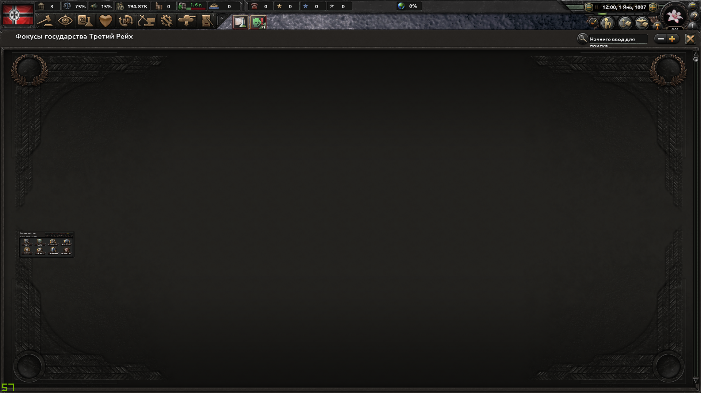
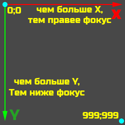
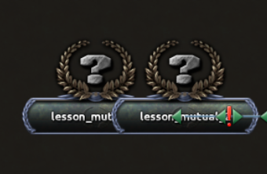
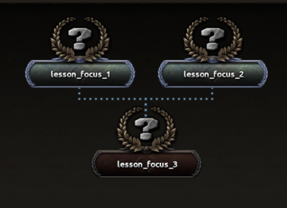
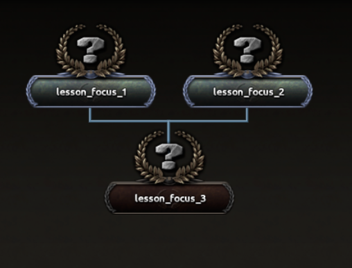
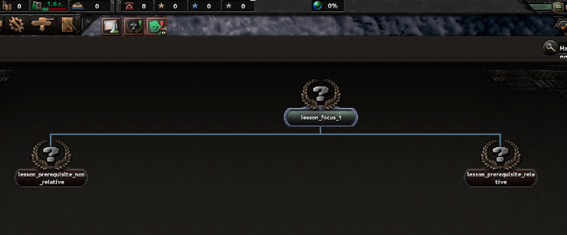
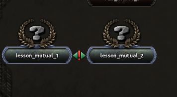
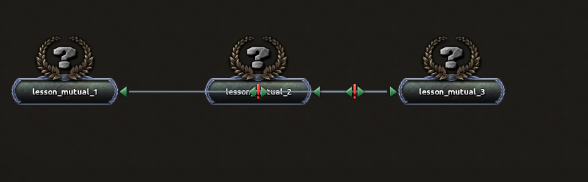
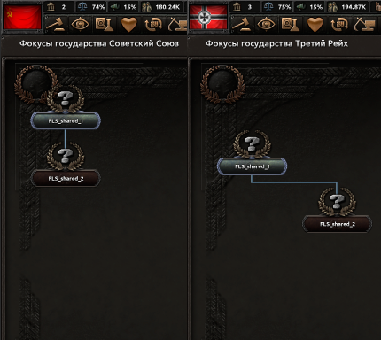

<h1>Создание и работа с деревьями фокусов. Универсальные области действия ROOT и FROM</h1>

<h2>Содержание:</h2> <h3> 
	1. Основа фокусов. Понятие Блока. Список блоков и их назначение 
	2. Создание дерева фокусов. Привязка дерева к стране. 
	3. Взаимосвязь между фокусами. Абсолютная и относительная позиция. Предпосылки. 
	4. Условия. Блок available. Блок allow_branch 
	5. Примеры фокусов с Относительной и Абсолютной позицией. Примеры взаимоисключающих фокусов.  
	6. Области действия. Условные (динамические) области действия. 
	7. Блок limit. Условный оператор. Блок random_list. 
	8. Работа с Shared фокусами 
	9. Работа с непрерывными фокусами 
	10. 8 советов новичкам, к которым стоит прислушаться 
</h3>

Фокусы являются основной игры. Основной принцип их действия таков: вы ставите себе задачу, к примеру, привести новую партию к власти.
 
Следовательно, ваша цепь фокусов должна приводить к власти новую партию. Разумеется, никто не запрещает вам сделать мега-ультимативный фокус, но это 
считается правилом плохого тона. В этом гайде мы на примере простейшей ветки фокусов разберем их создание и работу с ними.


<h3>Каков основной синтаксис создания фокусов?</h3> 

``{ }``- Блок. Каждый блок открывается и закрывается, и несет в себе какую-то часть скрипта
Основные блоки: 
 ``focus`` и ``shared_focus`` - собственно, блок- указатель для движка
 ``available`` - блок, проверяющий при каких условиях фокус доступен для изучения
 ``allow_branch`` - блок, отвечающий за видимость конкретного фокуса и его "потомков". Об allow_branch будет рассказано далее
 ``prerequisite`` - предпосылки. Какие фокусы должны быть выполнены, чтобы этот фокус был доступен для изучения
 ``mutually_exclusive`` - Взаимоисключающие. Если должен быть выбор из нескольких фокусов, они должны быть взаимоисключающими друг с другом.
 ``select_effect`` - Эффект при выборе фокуса. Не отображается в наградах.
 ``completion_reward`` - Эффект при выполнении фокуса 
 ``offset`` - Смещение shared фокусов при определенных условиях
 ``ai_will_do`` - Вероятность того, что фокус возьмет ИИ. Подробнее читайте в статье об искуственном интеллекте
 ``bypass`` - Условие, при котором фокус может быть пропущен

В этой статье будут использованы следующие элементы:
 ``[]`` - Переменная/выбираемое значение. Например, скоупы или локализуемые строки. То есть то, что указано в квадратных скобках, вы придумываете сами.
Исключение - **скоупы**. Они задаются исходя из таблицы. Впрочем, обо всем по порядку

<h3>Начнем с основы каждого дерева:</h3>

    focus_tree = { - Эта строка указывает движку игры, что указанный далее код читается как последовательное дерево фокусов. 
        id = lesson_focus - Уникальный айди дерева фокусов. Он нужен для команды load_focus_tree, о которой будет позднее
	    country = {  - Этот блок (да, блок, а не строка) отвечает за страну, которой доступна ветка фокусов. Как это работает?
		factor = 0 - Изначально фактор (т.е шанс) выдачи ветки этой стране равен нулю, но
		modifier = { - Мы добавляем модификатор, который меняет этот шанс
			add = 12 - Собственно, add = 10 это 100% шанс выдачи. Чем больше число, тем приоритетнее условие
			tag = GEM - А это собственно условие. Здесь может быть любой триггер из тех, что на вики: https://hoi4.paradoxwikis.com/Conditions
		}
	}
Что нам делать, если мы хотим, чтобы страна случайным образом получала одно из двух деревьев? Все очень просто: делаем два дерева с фактором 5

Итак, мы создали ветку фокусов. До тех пор, пока в ней ни одного фокуса, в игра вы будете видеть лишь пустую ветку  

Что нам делать дальше? Самое главное - не забыть следующие строки:

    continuous_focus_position = { x = число y = число } - Данная строка отвечает за положение непрерывных фокусов, о создании которых я тоже расскажу
	
    default = no - Обязательная строчка, при отсутствии которой игра будет считать это дерево стандартным, т.е так называемым "Генериком"

Итак, с формальностями покончено. Перейдем к способам работы с деревом

Фокусы бывают двух видов: **Стандартные** и **Shared**. 

Для начала разберемся со стандартными:

Каждый стандартный фокус (в отличие от Shared) *принадлежит какому-либо дереву*, т.е находится **ВНУТРИ блока focus_tree**

ВНИМАНИЕ: Текст ниже лишь является описанием. Подробнее о некоторых функциях будет написано непосредственно в фокусах

    focus = { - Данной командой мы указываем движку игры, что мы создаем фокус. 
        id = lesson_focus_1 - Уникальный айди фокуса. Для чего он используется? Для локализации, для эффекта complete_national_focus и триггера has_completed_focus.
        icon = [Код спрайта] - Иконка фокуса. Подробнее в статье о графической составляющей игры 
        x = [число] - Смещение по оси Х
        y = [число] - Смещение по оси У 
        relative_position_id = [айди фокуса] - об этом чутка ниже

На этом моменте мы остановимся поподробнее, и сейчас я расскажу вам, как работает система координат в дереве фокусов 

Расстояние между двумя фокусами по оси X, если у них одинаковый Y, всегда должно быть не меньше чем 2

В противном случае фокусы будут "налезать" друг на друга 

## Взаимосвязь между фокусами

А сейчас я расскажу вам о relative_position_id

У позиции фокуса есть два вида: Абсолютная и Относительная. В каждом дереве должен быть как минимум ОДИН фокус с Абсолютной позицией

Абсолютная позиция задается через x и y. В этом случае они показывают позицию фокуса в дереве 

Однако, если мы вставим строку relative_position_id = [айди фокуса] - они будут обозначать не КООРДИНАТЫ, а СМЕЩЕНИЕ по осям 

Смещение относительно фокуса, айди которого мы указали. Об этом - далее

        prerequisite = { focus = [айди фокуса] } - Предпосылка национального фокуса 
У фокуса может быть несколько предпосылок, или же выбор между ними. Как прописать их?

        prerequisite = { focus = [айди фокуса] OR = [айди фокуса] } - Так мы делаем выбор между двумя фокусами

        prerequisite = { focus = [айди фокуса] }
        prerequisite = { focus = [айди фокуса] } - А так задается несколько предпосылок. 

  

        available = { } - Условие доступности.

Все триггеры, применяемые здесь, есть на вики. Как это работает? Узнаете ниже 

        allow_branch = { } 
        
Казалось бы, все просто: выполняешь условия и открывается ветка фокусов. Но есть одна проблема: Игра проверяет доступность при запуске. У этого есть решение, оно будет расписано ниже, однако без него ваша ветка не появится.

        mutually_exclusive = { [айди фокуса] } - Взаимоисключающие фокусы. Подробнее на примере 

        cost = [число] - Время выполнения фокуса в днях. Однако, учтите: по умолчанию цена имеет множитель 7. Т.е cost = 1 значит, что 
        фокус будет выполняться 7 дней 
        completion_reward = { 
        } - Эффект при выполнении фокуса 
    }

Итак, с основой разобрались. Пора переходить к примерам 

    focus = {
        id = lesson_focus_1
        icon = GFX_goal_lesson_focus 
        x = 10
        y = 0
        cost = 10
        completion_reward = {
            add_political_power = 1
        }
    }

Итак, фокус который длится 70 дней и дает 1 политической власти 

    focus = {
        id = lesson_prerequisite_relative
        icon = GFX_goal_lesson_focus
        x = 3
        y = 1
        relative_position_id = lesson_focus_1
        prerequisite = { focus = lesson_focus_1 }
        cost = 10 
        completion_reward = {
            add_stability = 0.01
        } 
    }

А это фокус, предпосылкой к которому является предыдущий созданный нами фокус. Так же он смещен на 1 ед. по Осям X и Y 

    focus = {
        id = lesson_prerequisite_non_relative
        icon = GFX_goal_lesson_focus
        x = 3
        y = 1
        prerequisite = { focus = lesson_focus_1 }
        cost = 10 
        completion_reward = {
            add_stability = 0.01
        } 
    }

А вот тот же фокус, но с Абсолютными, а не Относительными координатами

С предпосылками и относительной позицией разобрались. Переходим к Взаимоисключающим

    focus = {
        id = lesson_mutual_1
        icon = GFX_goal_lesson_focus
        x = 0
        y = 3
        cost = 10
        mutually_exclusive = { focus = lesson_mutual_2 }
    }
    focus = {
        id = lesson_mutual_2
        icon = GFX_goal_lesson_focus
        x = 0
        y = 3
        cost = 10
        mutually_exclusive = { focus = lesson_mutual_1 }
    }

Эти два фокуса Взаимоисключающие. А если три?

    focus = {
        id = lesson_mutual_1
        icon = GFX_goal_lesson_focus
        x = 0
        y = 3
        cost = 10
        mutually_exclusive = { focus = lesson_mutual_2 }
        mutually_exclusive = { focus = lesson_mutual_3 }
    }
    focus = {
        id = lesson_mutual_2
        icon = GFX_goal_lesson_focus
        x = 0
        y = 3
        cost = 10
        mutually_exclusive = { focus = lesson_mutual_1 }
        mutually_exclusive = { focus = lesson_mutual_3 }
    }
    focus = {
        id = lesson_mutual_3
        icon = GFX_goal_lesson_focus
        x = 0
        y = 3
        cost = 10
        mutually_exclusive = { focus = lesson_mutual_1 }
        mutually_exclusive = { focus = lesson_mutual_2 }
    }

### Каждому фокусу каждые Взаимоисключающие. 

Итак, что теперь? Теперь мы разберемся с эффектами фокусов. А именно - мы поговорим про Области Действия, они же Скоупы 

## Области действия (Scopes)

Все скоупы условно делятся на 4 типа: Скоуп страны, Скоуп Региона, Скоуп Командующего и Условные, они же переменные, скоупы 

Скоуп страны - Тег этой самой страны. Все эффекты по умолчанию выполняются в этом скоупе 

   
    TAG ={
        add_political_power = 1
    }
    

То есть если вы не пропишите конкретный скоуп, по умолчанию будет выбран скоуп страны. 

В качестве цели можно выбрать любую существующую страну. 

Скоуп Региона - айди стейта. 

    
    STATE_ID = {

    }
    

Скоуп Командующего - сложный в освоении. Для того, чтобы лучше его понять, прочтите гайд о создании страны и новых командующих 
Если в кратце - в то время как остальные скоупы (коме Условных) указывают на конкретный объект, этот ВЫБИРАЕТ по условию 

    
    every_unit_leader = {
        has_id = [айди]
    }
    
### Условные скоупы

Что же такое условные скоупы? Их четыре:
    
1. ROOT
2. FROM
3. PREV 
4. THIS 

Как они работают? 

ROOT Обращается к самому первому возможному скоупу. То есть, в случае с фокусами, к стране-обладателю фокуса 
    
    FRA = {
        create_wargoal = {
            type = annex_everything 
            target = ROOT 
        }
    }
    

FROM обращается к инициатору действия, например в ивентах: 
    
    ENG = {
        country_event = { id = test.1 }
    }

    country_event = {
        id = test.1 
        ------
        option = {
            FROM = {
                add_political_power = -1
            }
        }
    }
    

Одну политвласть потеряет страна, которая выполнила фокус 

PREV ссылается на Предыдущий скоуп 
    
    FRA = {
        random_country = {
            GER = {
                create_wargoal = {
                    type = annex_everything
                    target = PREV
                }
            }
        }
    }
    
    
Германия получит цель войны против случайной страны. 

THIS ссылается на текущий скоуп 

По опыту - один из наиболее редко встречающихся. Наиболее распространенное применение - скриптовая локализация
    
    random_state = {
        add_resource = {
            type = oil
            amount = 50
            state = THIS
        }
    }
    
    
Казалось бы, вот оно, использование THIS... Проблема в том, что если убрать THIS, то ничего не изменится

## Дополнительные функции награды

Последнее, но не маловажное - ограничение, или по-просту лимит.  
Лимит необходим для ограничения области действия по заданным параметрам 

К примеру:
    
    every_country = {
        limit = {
            has_government = communism
        }
        add_political_power = 1
    }

    every_country = {
        limit = {
            has_government = fascism
        }
        add_political_power = -1
    }
    
Что мы видим? Область действия эффекта - Каждая страна. Однако, мы ограничиваем область действия только для тех стран, у которых
правящая партия - коммунизм (они получают 1 политвласть) и фашизм (соответственно, -1 политвласть)
    
Лимит используется не только в области действия, но и при работе с Условным оператором - конструкция if - else_if - else 

Как работает Условный оператор? Лимит! 

возьмем пример: 
    
    completion_reward = {
        if = {
            limit = {
                has_political_power > 0
            }
            add_political_power = -1
        }
        else_if = {
            limit = {
                has_political_power > 0
                has_stability > 0.5
            }
            add_stability = 0.01
        }
        else = {
            add_political_power = 1
        }
    }
    

Что произойдет при выполнении фокуса? А все очень просто: 

Игра проверяет выполнение условий

    ЕСЛИ больше 0 политвласти, отнимается 1 политвласть
    Однако, если кроме этого больше 50% стабильности, добавляется 1% стабильности
    ИНАЧЕ добавляется 1 политвласть

Можно ли было написать не if - else_if - else, а, к примеру, два if? И да, и нет 

    
    completion_reward = {
        if = {
            limit = {
                has_political_power > 0
            }
            add_political_power = -1
        }
        if = {
            limit = {
                has_political_power < 0
            }
            add_political_power = 1
        }
    }
    
<b>ТАК ДЕЛАТЬ МОЖНО!</b> У нас разные условия для эффекта, причем в данном примере диаметрально противоположные

    completion_reward = {
        if = {
            limit = {
                controls_state = 64
            }
            add_political_power = -1
        }
        if = {
            limit = {
                controls_state = 63
            }
            add_political_power = 1
        }
    }
    
<b>ТАК ДЕЛАТЬ МОЖНО, ЕСЛИ ОБА ЭФФЕКТА ВОЗМОЖНЫ ОДНОВРЕМЕННО</b>. Если вам нужно в несколько регионов добавить фабрики, но есть вероятность что игрок ими не владеет, вы пишете конструкцию с if - if и игра будет выполнять те, условие которых выполнено
    
    completion_reward = {
        if = {
            limit = {
                has_political_power > 0
            }
            add_political_power = -1
        }
        if = {
            limit = {
                has_political_power > 0
                has_stability > 0ю5
            }
            add_political_power = 1
        }
    }
    
<b>ТАК ДЕЛАТЬ НЕЛЬЗЯ!</b> Если вы хотите получить разный эффект в зависимости от того, больше 50% стабильности у страны или меньше,
вы должны ОБЯЗАТЕЛЬНО использовать конструкцию if - else_if, иначе у вас будут выполнены ОБА эффекта 

А как вы относитесь к азарту? Верите ли в удачу? Если да, кидайте кубик, потому что мы переходим к Рандому!

Итак, random_list. Тут все до безумия просто 

    
    completion_reward = {
        random_list = {
            50 = {
                add_political_power = 1
            }
            50 = {
                add_political_power = -1
            }
        }
    }
    

С вероятностью 50% мы получим 1 политвласть, с вероятностью 50% мы потеряем 1 политвласть

А можно ли "подкрутить" результаты? Можно! Если вы хотите повысить шанс, вы должны указать условие для этого
К примеру, "Счастливчик" с высокой стабильностью:
    
    completion_reward = {
        random_list = {
            50 = {
                add_political_power = 1
                modifier = {
                    factor = 2
                    has_stability > 0.7
                }
            }
            50 = {
                add_political_power = -1
            }
        }
    }
    
Если у нас больше 70% стабильности, шанс успеха вырастает в два раза и теперь составляет 100%! 

А если мы хотим скрыть эффект, или притвориться что он есть? На помощь придут скрытые эффекты и тултипы
    
    completion_reward = {
        hidden_effect = {
            add_political_power = 1
        }
        effect_tooltip = {
            add_political_power = -1
        }
    }
    
Игрок будет думать, что потеряет 1 политвласть, но на самом деле он ее получит 

## Переходим к Shared фокусам!
    
Как было сказано ранее, Shared фокусы не привязаны к конкретному дереву, поэтому могут быть отображены в нескольких деревьях сразу
    
Как работают Shared фокусы? Вот пример:

    shared_focus = {
        id = FLS_shared_1
        cost = 1
        x = 0
        y = 1
        completion_reward = {
            add_political_power = 1
        }
    }

    shared_focus = {
        id = FLS_shared_2 
        cost = 1
        x = 0
        offset = {
            x = 2
            trigger = {
                tag = GEM 
            }
        }
        y = 1
        relative_position_id = FLS_shared_1
        prerequisite = { focus = FLS_shared_1 }
        completion_reward = {
            add_political_power = 2
        }
    }

    focus_tree = {
	    id = fls_focus
	
        country = {
            factor = 0
            modifier = {
                add = 15
                is_ai = no
            }
        }
	
	    continuous_focus_position = { x = 200 y = 2500 }
	
	    default = no
	
	    shared_focus = FLS_shared_1
    }

Первый фокус ЗАДАЕТ ВЕТКУ. То есть в дерево вписывается именно он, а за ним размещаются и устанавиливаются наследники (вы же помните prerequisite?)

Соответственно, второй фокус идет за первым, однако обратите внимание на координаты. 
Вы же помните про Абсолютную и относительную позицию? Так вот, у Shared фокусов, кроме прочего, есть параметр СМЕЩЕНИЯ ПО ОСИ. Что это значит?

Поскольку Shared фокусы могут быть отданы различным деревьям, нам выгодно сделать возможность переместить их для конкретной страны. Для этого существует параметр Offset

    
    shared_focus = {
        id = FLS_shared_2 
        cost = 1
        x = 1
        y = 1
        offset = {
            x = 2
            y = 2
            trigger = {
                tag = GEM 
            }
        }
    }

Что означает эта запись? А то, что этот фокус будет расположен по координатам X = 1, Y = 1 для всех стран, однако для страны с тегом GEM эти координаты будут равны 2  - как видно на картинке. у Германии фокусы расположены иначе

В остальном синтаксис Shared фокусов абсолютно идентичен простым. 

Осталось самое простое, и в то же время самое сложное: Непрерывные фокусы 

# Continuous Фокусы 
В отличие от национальных фокусов, Непрерывные фокусы расположены в отдельной папке 

    continuous_focus_palette = {
        id = generic_focus
        
        country = {
            factor = 1
        }
        
        default = yes
        reset_on_civilwar = no
                
        position = { x = 50 y = 1000 }
    }

Итак, это - дерево непрерывных фокусов. Что мы видим? 
Практически все здесь идентично заданию стандартного дерева фокусов. Отличие - строка reset_on_civil_war, которая указывает будет ли отменен фокус при начале Гражданской войны, и position вместо continuous_focus_position - поскольку здесь задаются изначальные координаты этого дерева непрерывных фокусов 

Рассмотрим простой пример ванильного contionuous-фокуса 

    focus = {
		id = continuous_naval_production - уникальный айди фокуса
		
		icon = GFX_goal_continuous_naval_production - Иконка
		
		available = { - Условие при котором фокус можно взять
		}
		
		idea = continuous_naval_production - а вот на этом мы остановимся поподробнее ниже
		
		ai_will_do = { - Желание ИИ
			factor = 1
		}
		
		supports_ai_strategy = ai_focus_naval - какую Стратегию ИИ поддерживает, подробнее в статье про работу с ИИ
		 
		daily_cost = 1 - Сколько политвласти отнимается в день
		
		available_if_capitulated = yes - Если страна капитулирует, фокус можно взять
	}

А теперь, чтобы нам было проще, мы немного приостановимся, и рассмотрим два вида влияния на страну - Эффекты и Модификаторы.

В чем их отличие, спросите вы? Эффект - МГНОВЕННЫЙ и ЕДИНОРАЗОВЫЙ. Модификатор - ВРЕМЕННЫЙ и ПОСТОЯННЫЙ 

Эффект срабатывает один раз, и отменить его действие может только другой эффект. Модификатор дает свой бонус, пока активен.

Поэтому вы не можете выдать модификатор через фокус. И поэтому вы не можете дать эффект нацдуху - только эффект при выдаче и удалении 
ОВ непрерывных фокусах есть три способа взаимодействия со страной: либо прописать идею, которая будет действовать пока фокус активен, либо выдать модификатор, либо выдать эффект при выборе и отмене фокуса.

Рассмотрим все три примера:

    focus = {
        id = contin_test_1 
        idea = continuous_air_production 
    }
    Это - СИЛЬНО сокращенный код фокуса, во время действия которого будет получена идея на производство авиации

    focus = {
        id = contin_test_2 
        modifier = {
            training_time_army_factor = -1
        }
    }
    Это - СИЛЬНО сокращенный код фокуса, во время действия которого будет выдан модификатор на скорость подготовки армии

    focus = {
        id = contin_test_3 
        select_effect = {
            add_stability = 0.1
        }
        cancel_effect = {
            add_stability = -0.1
        }
    }
    Это - СИЛЬНО сокращенный код фокуса, при выборе которого будет ывдано 10% стабильности, а при отмене будет удалено 10% стабильности

# Проблемы и сложности создания фокусов 

В последней "Главе" нашего гайда мы разберем несколько подводных камней, которые встречаются при работе с фокусами. Кроме того, вас ждет "совет бывалого"

1. Абсолютная позиция - зло. Даже не так. Это <b>ЗЛО</b>. Доказать это очень просто: если вы захотите сместить какую-то ветку в 10 фокусов влево, а седующие за ними - вправо на 1 по оси X, при абсолютной позиции вам придется менять все 20 фокусов. В относительной (если она сделана по-умному, а не через жопу) вам нужно поменять координаты 2х фокусов
2. Относительную позицию нужно уметь делать. <b>НИ В КОЕМ СЛУЧАЕ</b> не привязывайте все фокусы к одному. 

Вот пример, как делать <b>ХОРОШО</b>
    focus = {
		id = GEM_evac_focus
		x = 30
		y = 0
		cost = 5
	}
	
	focus = {
		id = GEM_exploration
		x = 0
		y = 1
		relative_position_id = GEM_evac_focus
		prerequisite = { focus = GEM_evac_focus }
		cost = 5
	}
	focus = {
		id = GEM_contact
		x = 0
		y = 1
		relative_position_id = GEM_exploration
		prerequisite = { focus = GEM_exploration }
		cost = 1
	}

Видите? Каждый фокус смещен относительно своей предпосылки

Вот пример как делать <b>ПЛОХО</b>

    focus = {
		id = GEM_evac_focus
		x = 30
		y = 0
		cost = 5
	}
	
	focus = {
		id = GEM_exploration
		x = 0
		y = 1
		relative_position_id = GEM_evac_focus
		prerequisite = { focus = GEM_evac_focus }
		cost = 5
	}
	focus = {
		id = GEM_contact
		x = 0
		y = 2
		relative_position_id = GEM_evac_focus
		prerequisite = { focus = GEM_exploration }
		cost = 1
	}
   
Нет, код, разумеется, рабочий, и фокусы будут расположены как надо, но вы теряете два главных преимущества Относительной позиции 
Первое - Вы не сможете сдвинуть часть фокусов, изменив координаты одного-двух 
Второе - вам придется ставить большие числа. Намного проще сместить на 1 вниз от предыдущего фокуса, чем на 10 вниз и 15 вправо от первого, согласны?

3. Allow_branch не сломан. Просто он проверяется на старте.
Если вам нужно, чтобы ветка открывалась после события (решение/ивент/другой фокус), то в Эффекте, после выполнения которого должна открываться ветка, необходимо вставить следующую строку: 

    mark_focus_tree_layout_dirty = yes 

На вики этого нету, но теперь вы это знаете

4. Табуляция и комментарии - не обязательны. Но они <b>ОЧЕНЬ ВАЖНЫ</b>

Ваш фокус не сломается от того, что строки враскоряку, но если вы работаете в команде, вам будет проще кооперироваться, если ваш код хорошо читается. 

Хороший код читается сверху вниз слева направо. 

<b>ТАК ДЕЛАЙТЕ:</b>

    focus = {
		id = GEM_xeno_fighting 
		icon = GFX_goal_GEM_xeno_fighting
		x = 0
		y = 1
		relative_position_id = GEM_shoot_the_diss
		prerequisite = { focus = GEM_shoot_the_diss }
		cost = 5
		completion_reward = {
			every_other_country = {
				limit = {
					OR = {
						is_pony_race = yes 
						is_griffon_race = yes 
						is_generic_race = yes 
					}
				}
				add_opinion_modifier = {
					target = ROOT 
					modifier = hates_race
				}
				reverse_add_opinion_modifier = {
					target = ROOT 
					modifier = hates_race
				}
			}
		}
	}

Код взят для примера из моего мода (сабмод на Equestria at War). Красиво, правда? Сразу видно, что скобки на месте.

<b>А ВОТ ТАК НЕ ДЕЛАЙТЕ</b>

    focus = {
		        id = GEM_xeno_fighting 
		icon = GFX_goal_GEM_xeno_fighting
		            x = 0
	        	y = 1
	        	relative_position_id = GEM_shoot_the_diss
		        prerequisite = { focus = GEM_shoot_the_diss }
		    cost = 5
	            	completion_reward = {
			every_other_country = {
		            		limit = {
		        			OR = {
						is_pony_race = yes 
						is_griffon_race = yes 
						is_generic_race = yes 
					}
			            	}
			        	add_opinion_modifier = {
					target = ROOT 
					modifier = hates_race
			            	}
				reverse_add_opinion_modifier = {
					target = ROOT 
		            	            		modifier = hates_race
				}
		            	}
	        	}
	}   

Попробуйте не глядя на предыдущий пример прочесть этот код. А скобки? Вот то-то

А комментарии? Комментарии важны дабы вы указали другим, что здесь нужно

    focus = {
		id = GEM_xeno_fighting # Фокус "Борьба с ксеносами"
		icon = GFX_goal_GEM_xeno_fighting # Такой спрайт
		x = 0 
		y = 1
		relative_position_id = GEM_shoot_the_diss # Фокус смещен относительно "Расстрела диссидентов"
		prerequisite = { focus = GEM_shoot_the_diss }
		cost = 5
		completion_reward = {
			every_other_country = { # Каждая страна полчит модификатор  
				limit = {
					OR = {
						is_pony_race = yes 
						is_griffon_race = yes 
						is_generic_race = yes 
					}
				}
				add_opinion_modifier = {
					target = ROOT 
					modifier = hates_race
				}
				reverse_add_opinion_modifier = {
					target = ROOT 
					modifier = hates_race
				}
			}
		}
	}

Если вы работает в команде, Комментарии <b>ОБЯЗАТЕЛЬНЫ</b>

5. Скриптовые эффекты и триггеры - это полезно.

Вы можете пользоваться ими. Никаких проблем в этом нету. 

Для использования скриптового эффекта вы пишете следующее: 

    completion_reward = {
        effect_name = yes 
    }

effect_name - Код скриптового эффекта

Для использования скриптового триггера вы пишете следующее:

    available = {
        trigger_name = yes 
    }

trigger_name - Код скриптового триггера 

6. Отладка фокусов - четыре команды, масса пользы 

Режим отладки, или Debug-Режим, очень полезен при создании фокусов, однако и без него вам доступны 4 консольные команды, которые сильно облегчат работу

Focus.Autocomplete - Команда активирует авто-выполнение фокусов для ВСЕХ стран (учитывайте это). Нужно проверить эффект? Авто-выполнение - ваш друг 
Focus.IgnorePrerequisites - Отключение предпосылок. Все фокусы доступны для изучения, если у них нет особых требований. Если они есть... 
Focus.NoChecks - Команда, отключающаяя проверку условий. То есть игра будет игнорировать блок available 
А что делать если две взаимоисключающих раскрываемых ветки? Как проверить обе? Здесь вам поможет команда 
reload focus - Команда, при активации которой игра заново загрузит файл фокусов. То есть она сбросит все выполненные фокусы. 

7. Айди фокусов могут быть любыми, но Порядок важен. 

Любой уникальный Айди фокуса игра примет, но не проще ли будет давать им айди, как-то связанные с сутью? Простой пример: 

Сравните фокусы

    focus = {
        id = GEM_1
    }

    focus = {
        id = GEM_arrest_communists
    }

Не правда ли, вторая надпись лучше отображает суть фокуса? Теперь, если вы будете делать только скрипт, и отдадите его на локализацию кому-то другому, ему будет проще определить, что название этого фокуса связано с аррестом коммунистов 

8. Логификация - залог поиска

Логи - неотъемлемая часть игры, которые помогают находить ошибки. Однако, по умолчанию выполнение фокусов не заносится в логи. Как это исправить? Да очень просто!
Для этого необходимо в эффекте записать следующую строку

	log = "[GetDateText]: [Root.GetName]: Focus [FOCUS_ID]"

Что мы сделали? Мы указали игре, что при выполнении эффекта в game.log будет занесена строка "Дата: Название страны: фокус АЙДИ_ФОКУСА
То есть если игра сломается, вы увидите когда это произошло, после какого события

На этом наш урок подходит к концу. Помните главное: <b>делать</b> скрипт фокусов - не сложно. Сложно <b>понять</b>, как это работает, особенно если у вас нету знаний в области программирования. Но если вы поймете, как это работает, вы не остановитесь перед самой сложной задачей
